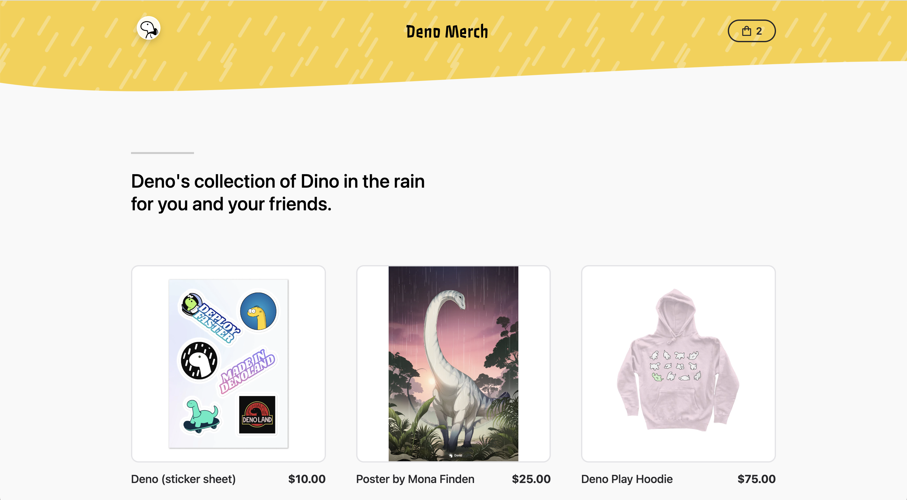

# Deno Merch

The Deno shop! Built with [Deno](https://deno.land/) and
[Fresh](https://fresh.deno.dev/), powered by [Shopify](https://www.shopify.com).

## Screen Shot



## Develop locally

- Clone the repository
- Set up Shopify credentials in the `.env`, follows `.env.example`.
- Start the project in local mode:
  ```bash
  deno task start
  ```

## Deploy to global

Sign in to [dash.deno.com](https://dash.deno.com), create a new project, and then link to your clone version of the repository. Please ensure add shopify secret before link:


